## El Método Científico
### Carlos Iván Espinosa

<small> [Wixsite](http://ciespinosa4.wixsite.com/carlosivanespinosa) / [@civanespinosa](https://twitter.com/civanespinosa) / [Github](https://ciespinosa.github.io/) / [ReserachGate](https://www.researchgate.net/profile/Carlos_Espinosa6)</small>


---


### Objetivo del capítulo

El estudiante tendrá la capacidad para proponer un diseño experimental para un trabajo de investigación y conocerá a que nos referimos con:

<section>

---

#### 1.1 El método científico

.fragment Las bases sobre las que soportamos la ciencia


<p>.
</p>
<p>.
</p>
<p>.
</p>


---

#### 1.2 Planeación de la investigación

.fragment ¿Cuáles son los factores que debo tomar encuenta para realizar una investigación?


<p>.
</p>
<p>.
</p>
<p>.
</p>

---

#### 1.3 Tratamientos y Variables
.fragment ¿Por qué es necesario definirlas?

<p>.
</p>
<p>.
</p>
<p>.
</p>

---
#### 1.4 Hipótesis
.fragment ¿Qué es una hipótesis y por qué es necesario definirla?


<p>.
</p>
<p>.
</p>
<p>.
</p>

---
#### 1.5 Control Local, Replicas y Aleatorización
.fragment Tres conceptos clave para diseñar experimentos


<p>.
</p>
<p>.
</p>
<p>.
</p>

</section>

--- &vertical

### 1.1 El método científico

Antes de empezar necesitamos comprender algunos temas filosóficos de la investigación.

 


>.fragment realmente no es tan doloroso 

***

### El método inductivo vs deductivo

```
```


<div class='span6'>
<h4> Deductivo </h4>
</div>

<div class='span6'>
<h4> Inductivo </h4>
</div>

<div class='span6'>

<p class="fragment current-visible">
Un número suficiente de observaciones confirmatorias y no contradictorias nos permite concluir que una teoría o ley es cierta (Gower 1997) 
</p>
</div>
<div class='span6'>
<p class="fragment current-visible">
Es el proceso de derivar explicaciones o predicciones a partir de leyes o teorías Karl Popper (1968, 1969)
</p>
</div>


***

### El método deductivo y generación de teorias

<p class="fragment current-visible"> Si Juan tiene fiebre y tiene infección,</p>

<p class="fragment current-visible">María tiene fiebre y tiene infección,</p>

<p class="fragment current-visible">Pedro tiene fiebre y tienen infección</p>

```
```
<p class="fragment current-visible">.... Entonces ...</p> 
<spam class="fragment current-visible">
  <spam class="fragment highlight-blue">... Todas las infecciones producen fiebre</spam>
</spam>


***

### El método inductivo y __falsear la hipótesis__

```
```

<p class="fragment current-visible"> Conocido como enfoque hipotético-deductivo </p>

<p class="fragment current-visible"> El principio de falsacionismo, las hipotesis son ... </p> <spam class="fragment current-visible">
<spam class="fragment highlight-blue">  ...falseables...  </spam>
</spam> <p class="fragment current-visible"> ya que probarlas es imposible.</p>
<p class="fragment current-visible"> Una hipótesis es falsable si  existe una observación incompatible con ella. </p>

***
### El método inductivo ejemplo


<p class="fragment shrink">  Sabemos que las infecciones producen fiebre pero ...  </p>


<spam class="fragment current-visible">
<spam class="fragment highlight-green">  ¿La infección por hongos produce fiebre?  </spam>
</spam>

```
```

<div class='span6'>
<p class="fragment current-visible">
 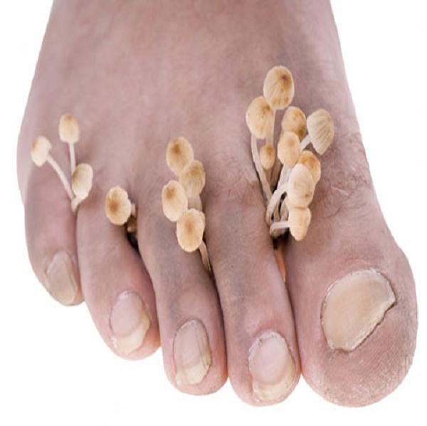
</p>

</div>

<div class='span6'>
<p class="fragment current-visible"> Hacemos un seguimiento de  pacientes con infección por hongos y vemos si presentan fiebre
</p>

<p class="fragment current-visible"> La hipótesis es;  los pacientes con infección por hongos presentan fiebre.
</p>

<spam class="fragment current-visible">
<spam class="fragment highlight-blue">  Falseamos la hipótesis, probamos si no se cumple esta hipótesis</spam>
</spam>

<p class="fragment current-visible"> La conclusión: no todas las infecciones producen fiebre
</p>
</div>

***
### Descripción de patrones y generación de modelos

>Una parte crucial del proceso científico es la descripción de patrones a partir de observaciones (Manly 1992)

```
```

<spam class="fragment current-visible">
<spam class="fragment highlight-blue">  Pero ¿Cómo podemos describir estos patrones? </spam>
</spam>

<spam class="fragment current-visible">
<spam class="fragment  highlight-red"> MODELOS </spam>
</spam>

***
### Modelos
```
```


<div class='span6'>
<p class="fragment current-visible">
 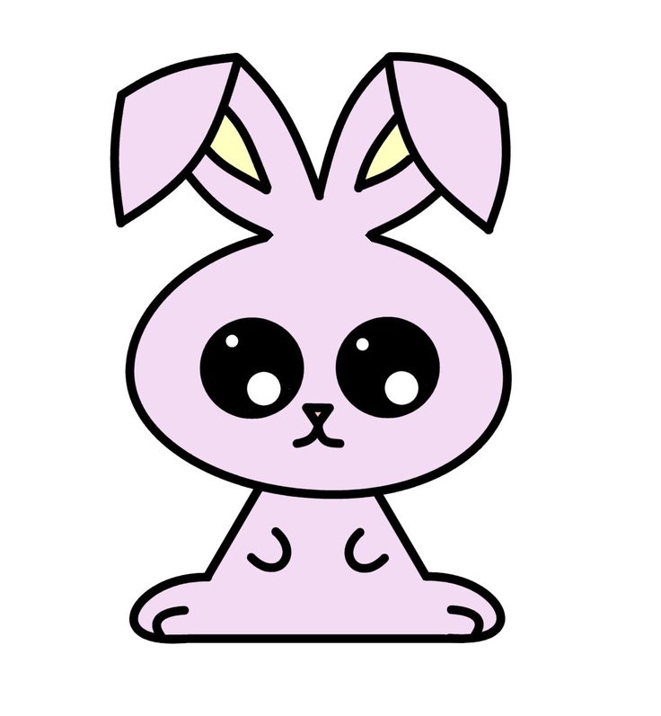
</p>
</div>

<div class='span6'>
<spam class="fragment current-visible"> 
<spam class="fragment highlight-red"> ¿Qué animal es este?</spam>
</spam>
<p class="fragment current-visible">
 Los modelos empíricos son descripciones matemáticas de las relaciones resultantes de los procesos más que los propios procesos.
</p>

<p class="fragment fade-out">
.
</p>

<p class="fragment current-visible">
Se utilizan para describir una relación entre las variables de respuesta y de predicción. 
</p>
</div>


***

### Un ejemplo de modelo

<p class="fragment current-visible">
La concentración de glucosa en la sangre se encuentra directamente relacionada con el consumo de carbohidratos de la persona.  Lo que se sabe es que por cada gramo de carbohidrátos consumido, la glucosa se eleva en 0.01mgr. 
</p>


```{r eval = T, fig.height= 4, fig.width=4}
library(ggplot2)
con<- rnorm(30,45,15)#consumo de carbohidratos
glu<- (con*0.01)#Aumento de glucosa
qplot(con, glu, xlab = "Consumo de Carbohidratos", 
      ylab = "Aumento de glucosa" )
```


--- &vertical
### 1.2 Planeación de la investigación

```
```

Imaginemos que un investigador propone la siguiente hipótesis

>La sustitución de ratas por ratones como animal de prueba para evaluar dieta es más eficiente en término de costo y tiempo

<p class="fragment shrink">
Parece una pregunta relevante pero hay varias cosas que necesita decidir...
</p>

.fragment ¿cuantos animales utilizar?...

.fragment ¿cuantas veces realizar el experimento?...

.fragment ¿Cuanta proteína se les ha de dar a los animales?...

.fragment y otras cuantas....

***

### ¿Qué hacer?
```
```

<div class='span6'>
<p class="fragment current-visible">
Documentar lo que se va hacer
</p>
</div>

<div class='span6'>
<p class="fragment current-visible">
Unas preguntas sencillas
</p>
</div>

<div class='span6'>
<p class="fragment current-visible">
Es importante que todo lo que hagamos este documentado y escrito
</p>
<p class="fragment current-visible">
Los objetivos y principalmente la metodología debe estar escrita y se debe actualizar cada vez que sea posible
</p>
</div>

<div class='span6'>

<p class="fragment current-visible">
¿Cuál  es mi objetivo?
</p>
<p class="fragment current-visible">
¿Qué  quiero saber?
</p>
<p class="fragment current-visible">
¿Cómo voy a realizar esta tarea?
</p>
<p class="fragment current-visible">
¿Por que hago esta tarea?
</p>
</div>

***

### Trabajemos un poco


 


Se realizarán grupos y se:

.fragment ...generará una pregunta...

.fragment ...definirá la hipótesis ...

.fragment ... se aclarará lo que quiero saber con este procedimiento...

--- &vertical

### 1.3  Tratamientos y Variables

#### Datos, observaciones y variables

> Para un  investigador, los datos consisten en una colección de observaciones. Las observaciones a su vez son usualmente unidades de muestreo.  En cada unidad de muestreo se obtienen variables.

<spam class="fragment current-visible">
<spam class="fragment highlight-green">
Esta muy claro no?
</spam>
</spam>

***
####   Variables aleatorias

>Es simplemente una variable cuyos valores no se conocen con certeza antes de tomar una muestra

```
```

<div class='span6'>
<p class="fragment current-visible">
Variables discretas
</p>
</div>


<div class='span6'>
<p class="fragment current-visible">
Variables continuas
</p>
</div>

<div class='span6'>
<p class="fragment current-visible">
Son aquellas variables que pueden unicamente tener valores enteros. Ejemplo??
</p>
</div>

<div class='span6'>
<p class="fragment current-visible">
Son aquellas variables que pueden tener valores continuos. Ejemplo??
</p>
</div>

***
#### Experimentos algunos conceptos

>El experimento consiste en un  protocolo para evaluar las implicaciones de observaciones generadas bajo circunstancias definidas

```
```

<p class="fragment current-visible">
<small>El <q>experimento comparativo</q>, implica que se establezca 
más de un conjunto de circunstancias en el experimento. Las respuestas observadas pueden y deben ser comparadas entre las diferentes circunstancias.
</small> </p>

<p class="fragment current-visible">
<small>.
</small> </p>

<p class="fragment current-visible">
<small>Los <q>tratamientos</q> son el conjunto de circunstancias creados para el experimento, en respuesta  a la hipótesis de investigación y son el centro de la misma.</small> </p>

<p class="fragment current-visible">
<small>.
</small> </p>

<p class="fragment current-visible">
<small>La <q>unidad experimental</q> es la entidad física o el sujeto expuesto al tratamiento y que es independientemente de otras unidades.</small> </p>

***
### a trabajar otra vez ....

 


<p class="fragment current-visible">
<small>  Recuerdan la hipótesis que hicimos....
</small> </p>
<p class="fragment current-visible">
<small>  bien ahora a completar el trabajo...
</small> </p>
<p class="fragment current-visible">
<small>  ...definir las variables ....
</small> </p>
<p class="fragment current-visible">
<small>  ... estamos haciendo un experimento comparativo?
</small> </p>
<p class="fragment current-visible">
<small>  ....cuales son los tratamientos ....
</small> </p>
<p class="fragment current-visible">
<small>  ... cual es la unidad experimental ....
</small> </p>


--- &vertical
### 1.4 La hipótesis

>A partir de nuestro modelo o de la teoría podemos hacer una predicción o predicciones; estas predicciones se llaman hipótesis de investigación.

```
```


.fragment <small>Si un determinado modelo es correcto, podemos predecir observaciones específicas en un nuevo conjunto de circunstancias. Esto es lo que Peters (1991) denomina la fase Popperiana del método científico, donde utilizamos pruebas críticas o formales para evaluar los modelos mediante la falsificación de hipótesis.</small>

***
### Bueno que es esto de falsear las hipótesis

<p class="fragment current-visible">
 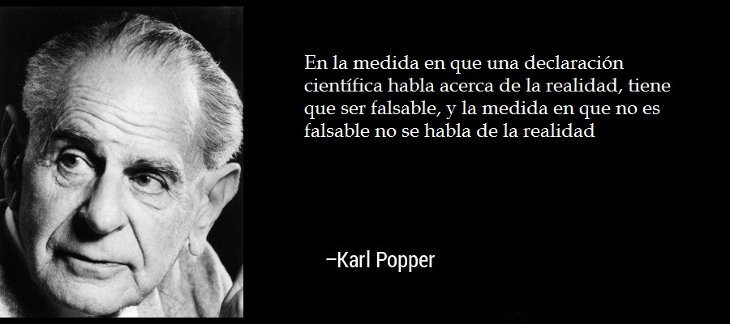
</p>


***
### Bueno que es esto de falsear las hipótesis

<p class="fragment current-visible">
El problema de la inducción nace del hecho de que no se puede afirmar algo universal a partir de los datos particulares que ofrece la experiencia.
</p>

<div class='span6'>
<p class="fragment current-visible">
 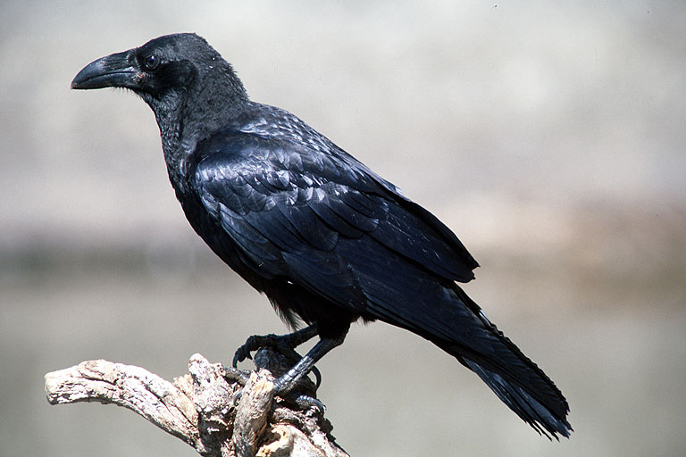
</p>
<p class="fragment current-visible">
Cuantos cuervos negros debo encontrar para asegurar que los cuervos son negros</p>
</div>

<div class='span6'>
<p class="fragment current-visible">
 
</p>
<p class="fragment current-visible">
Si encuentro un solo cuervo blanco puedo falsear la hipótesis que todos los cuervos son negros</p>
</div>

***
### Hipótesis falseables

>.fragment El avance en la ciencia está en falsar sucesivas teorías para así, sabiendo lo que no es, poder acercarse cada vez más a lo que es.

```
```

<div class='span6'>
<p class="fragment current-visible">
 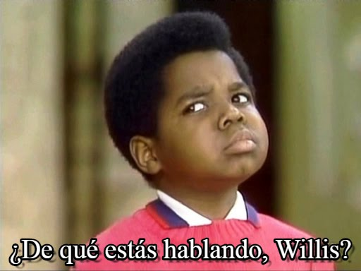
</p>
</div>
<div class='span6'>
<p class="fragment current-visible">
Para que una hipótesis sea falseable esta debe ser lo más precisa posible
</p>
<p class="fragment current-visible">
Ej. La mal nutrición puede causar obesidad
</p>
<spam class="fragment fade-up">
<spam class="fragment fade-out">
¿Se puede falsear esta hipótesis?
</spam>
</spam>

<p class="fragment current-visible">
¿Podemos hacerla mas precisa?
</p>


</div>

***
### A falsear nuestras hipotesis

<p class="fragment current-visible">

</p>

<p class="fragment current-visible">
Revisemos lo trabajado y mejorar las hipótesis para que sean falseables
</p>


***
### La hipótesis y el diseño de experimentos

>.fragment Las hipótesis establecen un conjunto de circustancias sobre las cuales queremos probar algo, o mejor dicho falsear algo.

.fragment De esta manera las hipótesis definen en primera medida los experimentos a desarrollarse.

```
```

<div class='span6'>
<p class="fragment current-visible">
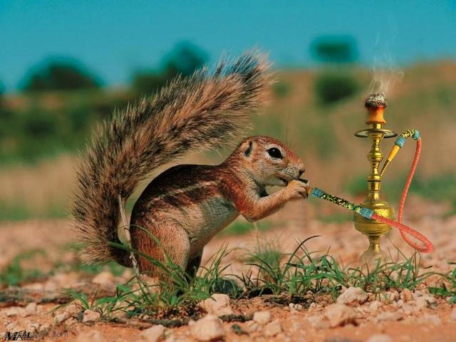
</p>
</div>

<div class='span6'>
<p class="fragment current-visible">
Las ardillas utilizan plantas para generar un estado de placer
</p>
<p class="fragment current-visible">
¿Qué implicaciones sobre el diseño tiene esta hipótesis?
</p>
</div>

***
### La hipótesis y los tratamientos


<p class="fragment current-visible">
El objetivo de los tratamientos puede ser para "escoger al ganador" o  para aclarar los mecanismos básicos asociados con los tratamientos.
</p>


>.fragment ¿Qué significa esto?

***
### La hipótesis y los tratamientos

.fragment Los tratamientos de control son un punto de referencia


.fragment Un control al que no se da tratamiento revelará las condiciones en las que se efectuó el experimento. 

>.fragment Por ejemplo, los fertilizantes con nitrógeno suelen ser efectivos, pero no producirán respuestas en campos con alta fertilidad. Un control de fertilizante sin nitrógeno señalará las condiciones básicas de fertilidad del experimento

.fragment ¿Cuál sería un control, si estoy probando un medicamento? ¿Por qué?

***
### La hipótesis y los tratamientos

.fragment El diseño de tratamientos con múltiples factores amplía las inferencias 

>.fragment En el artículo "The Arrangement of Field Experiments", Fisher (1926) observó que el proverbio más repetido respecto a los 
experimentos de campo era el que decía: Debemos hacer algunas preguntas a la naturaleza, y de preferencia, una a la vez. 

.fragment Muchas veces es mejor tener más de un factor involucrado, realizar lo que se conocen como diseños factoriales.

.fragment Piensen en la misma pregunta de antes sobre la efectividad de un medicamento y dígame como podríamos hacer un diseño factorial.

***
### A seguir trabajando

<p class="fragment current-visible">

</p>

<p class="fragment current-visible">
Defina los tratamientos u observaciones a realizar con el fin de testar la hipótesis
</p>


--- &vertical

### 1.6 Control local de errores experimentales

>Los principales objetivos de la mayoría de los experimentos son las comparaciones claras y exactas entre tratamientos a través de un conjunto apropiado de condiciones.

```
```

<div class='span6'>
<p class="fragment current-visible">

</p>
</div>

<div class='span6'>
<p class="fragment current-visible">
Es correcta esta comparación. Existen condiciones similares para realizar las comparaciones.
</p>

<p class="fragment current-visible">
El tener un control experimental asegura reducir la varianza del error experimental
</p>

</div>

***
### El Control Local

<div class='span6'>
<p class="fragment current-visible">

</p>
</div>

<div class='span6'>
<p class="fragment current-visible">
Un investigador tiene el control sobre:
</p>

<p class="fragment current-visible">
1. La técnica
</p>
<p class="fragment current-visible">
2. Selección de unidades muestreales
</p>
<p class="fragment current-visible">
3. Uniformidad en tratamientos
</p>
<p class="fragment current-visible">
4. Selección de diseño experimental
</p>
<p class="fragment current-visible">
5. Medición de covariables
</p>

</div>

***
### 1. La técnica

<p class="fragment current-visible">
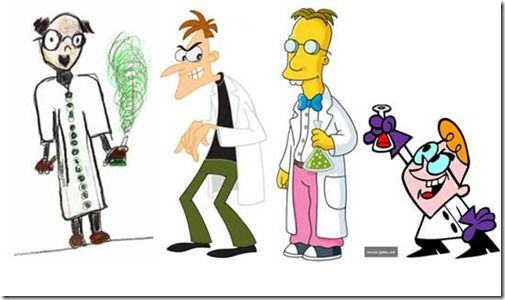
</p>

<p class="fragment current-visible">
Las técnicas pobres pueden afectar la exactitud de las observaciones y sesgar los resultados. 
</p>

<p class="fragment current-visible">
La variación introducida en las observaciones por las técnicas pobres, no necesariamente  es aleatoria y por lo tanto, no está sujeta a las mismas leyes de probabilidad que se asocian con la inferencia estadística.
</p>

***
### 2. Selección de unidades experimentales uniformes 

>Las unidades experimentales heterogéneas producen valores grandes en la varianza del error experimental. La comparación precisa entre los tratamientos requiere la selección de unidades experimentales uniformes para reducir el error experimental. 

.fragment Una selección demasiado restringida puede producir condiciones de uniformidad artificiales. 

.fragment Las unidades deberían representar una variedad suficiente de condiciones, sin que aumente innecesariamente la heterogeneidad de las unidades experimentales (Kuehl 2000)

.fragment Y que significa esto?

***
### 3. La segregación en bloques (bloquización) 

<p class="fragment current-visible">
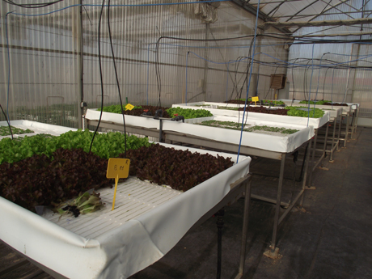
</p>
<p class="fragment current-visible">
Los bloques permiten por un lado reducir el error experimental al poner bajo condiciones similares los tratamientos (en un mismo bloque) pero mantener la heterogeneidad natural, al comparar entre bloques
</p>


***
### 4. Selección del Diseño experimental

<p class="fragment current-visible">
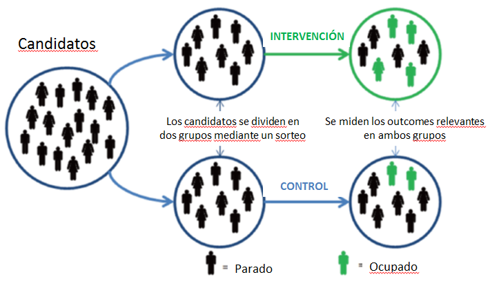
</p>
<p class="fragment current-visible">
El diseño experimental nos permite asegurar que los factores que pueden intervenir en los resultados y que no los estoy evaluando afecten por igual a todo el experimento.
</p>

***
### 5. Covariadas para el control estadístico de la variación

<p class="fragment current-visible">
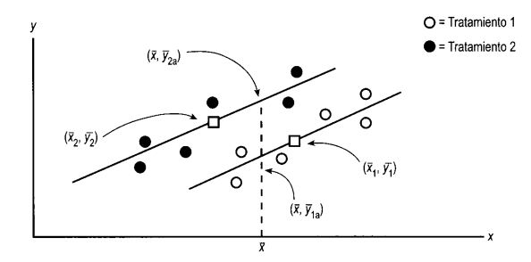
</p>
<p class="fragment current-visible">
Las covariadas son aquellas variables que podrían afectar la respuesta observable.  Cuando esto sucede es mejor controlar la covariada para incluir en el modelo
</p>

***
### Finalmente no hay que trabajar más


<p class="fragment current-visible">
Los engañe, seguimos trabajando ahora analicen como generarían mecanismos de control local para el estudio planteado.
</p>


---&vertical

### 1.7 Población y muestras

>Los investigadores por lo general desean hacer inferencias (conclusiones) sobre una población, la cual se define como el conjunto de todas las posibles observaciones de interés (Quinn y Keough 2002)


.fragment Población estadística

.fragment Población natural o biológica


***
### Población y muestras

>La colección de observaciones que tomamos de la población se llama  `muestra` y el número de observaciones en la muestra se conoce como  tamaño de la muestra (por lo general dado el símbolo n). 

<div class='span6'>
<p class="fragment current-visible">
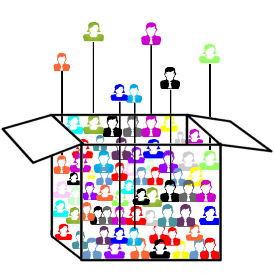
</p>
</div>

<div class='span6'>
<p class="fragment current-visible">
¿Que características debe tener esta muestra?
</p>

<p class="fragment current-visible">
Todas las observaciones deberían tener la misma probabilidad de ser colectadas
</p>

<p class="fragment current-visible">
El muestreo no debería generar sesgos en la muestra. 
</p>
</div>


--- &vertical 

### 1.8 Replicas

>La réplica implica una repetición independiente del experimento básico. Dicho de manera más específica, cada tratamiento se aplica de manera independiente a dos o más unidades experimentales. 

<spam class="fragment current-visible">
<spam class="fragment highlight-green">
Pero ¿por qué hacer replicas?
</spam>
</spam>

.fragment Demuestra que se pueden reproducir los resultados. 

.fragment Proporciona cierto grado de seguridad de resultados.

.fragment Proporciona las medias para estimar la varianza  del error experimental. 

.fragment Proporciona la posibilidad de aumentar la precisión en la estimación de las medias de los tratamientos. 

***
### Replicar

<div class='span6'>
<p class="fragment current-visible">
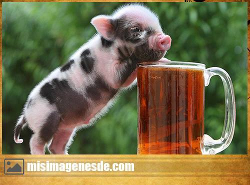
</p>

<p class="fragment current-visible">
La unidad de observación puede no ser equivalente a la unidad experimental.
</p>
</div>

<div class='span6'>
<p class="fragment current-visible">
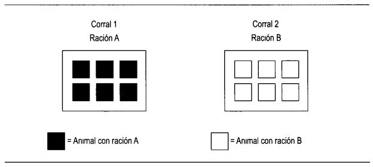
</p>

<p class="fragment current-visible">
Se quiere evaluar la efectividad de un nuevo alimento.  Seis animales para cada tipo.
</p>

</div>

***


--- #transitions

## TRANSITION STYLES
You can select from different transitions, like: 

```{r echo = F, results = 'asis', comment = NA}
transitions = c("cube", "page", "concave", "zoom", "linear", "fade", "none", "default")
names(transitions) = gsub("^([a-z])", "\\U\\1", transitions, perl = TRUE)
x = sprintf("[%s](?transition=%s#/transitions)", names(transitions), transitions)
cat(paste(x, collapse = ' - '))
```

--- #themes

## Themes

Reveal.js comes with a few themes built in: 

```{r echo = F, results = 'asis', comment = NA}
themes = c("sky", "beige", "simple", "serif", "night", "default", "solarized", "moon")
names(themes) = gsub("^([a-z])", "\\U\\1", themes, perl = TRUE)
x = sprintf("[%s](?theme=%s#/themes)", names(themes), themes)
cat(paste(x, collapse = ' - '))
```

<small>* Theme demos are loaded after the presentation which leads to flicker. In production you should load your theme in the `<head>` using a `<link>`.</small>


--- &vertical ds:soothe 

## Sobre mí

<div class='span6'>
<p class="fragment current-visible"> Estudie Biología en la Universidad del Azuay </p>
<p class="fragment current-visible"> Mis estudios de posgrado los curse en la Politécnica de Madrid donde obtuve mi título de PhD.</p>
<p class="fragment current-visible"> Trabajo en ecología de comunidades, bioestadística y metodología de la investigación. </p>
</div>
<div class='span6'>
  
</div>

*** ds:soothe
## Mi familia
 

*** ds:soothe
## María Sol

<div class='span6'>
  <p class="fragment current-visible">Ella estudia en el Amauta y le gusta el basquet, es una muy buena deportista</p>
<p class="fragment current-visible">Le encanta la cocina dice que de grande ella será una Chef</p>
</div>
<div class='span6'>
 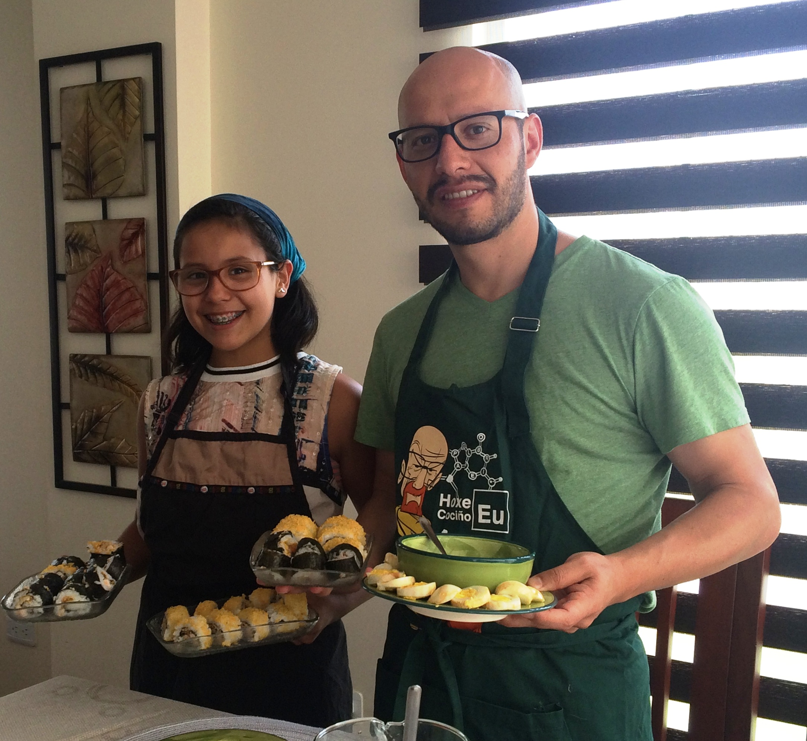

</div>

*** ds:soothe
## Juan Cristobal

<div class='span6'>
  <p class="fragment current-visible">El estudia en el Amauta y le gusta el basquet</p>
<p class="fragment current-visible">Es cinturon rojo en taekwondo</p>
<p class="fragment current-visible">Le encanta la naturaleza y dice que quiere ser científico posiblemente biólogo</p>
</div>
<div class='span6'>
 

</div>

*** ds:soothe
## María Dolores

<div class='span6'>
  <p class="fragment current-visible">Ella es bióloga pero trabaja en temas administrativos</p>
<p class="fragment current-visible">Le encanta el medio ambiente y sobre todo el mar</p>
<p class="fragment current-visible">Esta estudiando una maestría</p>
</div>
<div class='span6'>
 
</div>

.small [a iniciar](#/0)


